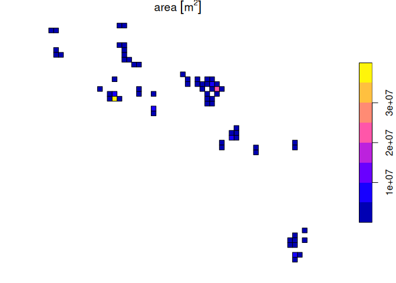

<!-- README.md is generated from README.Rmd. Please edit that file -->

# RLErestricted

<!-- badges: start -->
<!-- badges: end -->

`RLErestricted` is an R package that contains a set of tools suitable
for calculating the metrics required for making assessments of
ecosystems against the **IUCN Red List of Ecosystems** categories and
criteria.

## Overview

The `RLErestricted` package was developed to assist users conduct
assessments for the IUCN Red List of Ecosystems in `R`. Assessments of
ecosystems under the IUCN Red List of Ecosystems criteria require
calculation of standardised metrics that were developed to objectively
assess risk to ecosystem ([Keith et
al. 2013](https://journals.plos.org/plosone/article?id=10.1371/journal.pone.0062111)).

This package was designed to assist in the calculation of two standard
measures of the size of an ecosystems’ geographic distribution specified
in the IUCN Red List of Ecosystems guidelines ([Bland et
al. 2017](https://doi.org/10.2305/IUCN.CH.2016.RLE.3.en)). These are the
Extent of Occurrence (EOO) and Area of Occupancy (AOO).

In conducting an assessment with this package, we assume that you are
familiar with IUCN red listing protocols. In particular, you should
consult the IUCN guidelines and follow the recommended steps to ensure
consistent application of IUCN criteria ([Bland et
al. 2017](https://doi.org/10.2305/IUCN.CH.2016.RLE.3.en)).

We also assume that you are reasonably familiar with the `R` programming
language, and have some experience in conducting analyses of vector data
within the `R` environment using the package `sf` (simple features).

This is a work in progress and we aim to continually add new functions
to newer versions of package. Suggestions are welcomed, as are offers
for collaborative development.

## Installation

You can install the development version of RLErestricted from
[GitHub](https://github.com/) with:

``` r
# install.packages("devtools")
devtools::install_github("red-list-ecosystem/RLErestricted")
```

## Example

The goal of `RLErestricted` is to assist users calculate one spatial
metric (area of occupancy or AOO) to a group of polygons describing the
distribution of an ecosystem. This information can be used to apply one
of the criteria of the IUCN Red List of Ecosystems.

The first step is to create a AOO grid over the extent of the ecosystem:

``` r
library(RLErestricted)
library(sf)
#> Linking to GEOS 3.12.0, GDAL 3.8.4, PROJ 9.3.1; sf_use_s2() is TRUE
library(dplyr)
#> 
#> Attaching package: 'dplyr'
#> The following objects are masked from 'package:stats':
#> 
#>     filter, lag
#> The following objects are masked from 'package:base':
#> 
#>     intersect, setdiff, setequal, union
glaciers_on_volcanos <- tropical_glaciers |>
    dplyr::filter(ecosystem_name %in% "Volcanos de Peru y Chile") |>
    sf::st_transform(crs = 32719)

AOO_grid <- create_AOO_grid(glaciers_on_volcanos)
#> Warning: attribute variables are assumed to be spatially constant throughout
#> all geometries
```

We can see the results is a grid of cells with information about the
area of the ecosystem:

``` r
AOO_grid
#> AOO grid for Volcanos de Peru y Chile with a total of 34 cells and total extent of:
#> 75.61276 [km^2]
#> There are 23 cells with small occurrences (<1 % of cell size)
#> There are 15 cells with marginal occurrences (<1 % of total extent)
#> Simple feature collection with 34 features and 5 fields
#> Geometry type: POLYGON
#> Dimension:     XY
#> Bounding box:  xmin: 69423.82 ymin: 7804685 xmax: 539423.8 ymax: 8384685
#> Projected CRS: WGS 84 / UTM zone 19S
#> # A tibble: 34 × 6
#>    layer ecosystem_name       area                     geoms prop_area cumm_area
#>  * <int> <chr>               [m^2]             <POLYGON [m]>       [%]       [%]
#>  1  2917 Volcanos de Peru … 3.73e0 ((69423.82 8284685, 7942…   3.73e-6   4.93e-6
#>  2   275 Volcanos de Peru … 4.51e1 ((529423.8 7804685, 5394…   4.51e-5   6.46e-5
#>  3  2998 Volcanos de Peru … 9.89e3 ((319423.8 8294685, 3294…   9.89e-3   1.31e-2
#>  4  3427 Volcanos de Peru … 1.08e4 ((129423.8 8374685, 1394…   1.08e-2   2.75e-2
#>  5  3053 Volcanos de Peru … 1.12e4 ((309423.8 8304685, 3194…   1.12e-2   4.23e-2
#>  6  2997 Volcanos de Peru … 1.35e4 ((309423.8 8294685, 3194…   1.35e-2   6.02e-2
#>  7  1110 Volcanos de Peru … 1.65e4 ((479423.8 7954685, 4894…   1.65e-2   8.20e-2
#>  8  2875 Volcanos de Peru … 2.52e4 ((209423.8 8274685, 2194…   2.52e-2   1.15e-1
#>  9  2925 Volcanos de Peru … 2.70e4 ((149423.8 8284685, 1594…   2.70e-2   1.51e-1
#> 10  3315 Volcanos de Peru … 2.75e4 ((129423.8 8354685, 1394…   2.75e-2   1.87e-1
#> # ℹ 24 more rows
```

And we can plot this grid:

``` r
plot(AOO_grid['area'])
```


