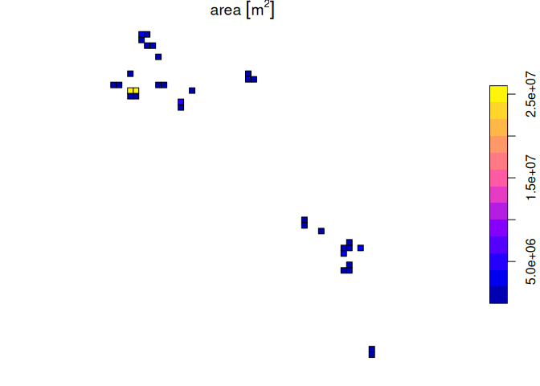

<!-- README.md is generated from README.Rmd. Please edit that file -->

# RLErestricted

<!-- badges: start -->
<!-- badges: end -->

`RLErestricted` is an R package that contains a set of tools suitable
for calculating the metrics required for making assessments of
ecosystems against the **IUCN Red List of Ecosystems** categories and
criteria.

## Overview

The `RLErestricted` package was developed to assist users conduct
assessments for the IUCN Red List of Ecosystems in `R`. Assessments of
ecosystems under the IUCN Red List of Ecosystems criteria require
calculation of standardised metrics that were developed to objectively
assess risk to ecosystem ([Keith et
al. 2013](https://journals.plos.org/plosone/article?id=10.1371/journal.pone.0062111)).

This package was designed to assist in the calculation of two standard
measures of the size of an ecosystems’ geographic distribution specified
in the IUCN Red List of Ecosystems guidelines ([Bland et
al. 2017](https://doi.org/10.2305/IUCN.CH.2016.RLE.3.en)). These are the
Extent of Occurrence (EOO) and Area of Occupancy (AOO).

In conducting an assessment with this package, we assume that you are
familiar with IUCN red listing protocols. In particular, you should
consult the IUCN guidelines and follow the recommended steps to ensure
consistent application of IUCN criteria ([Bland et
al. 2017](https://doi.org/10.2305/IUCN.CH.2016.RLE.3.en)).

We also assume that you are reasonably familiar with the `R` programming
language, and have some experience in conducting analyses of vector data
within the `R` environment using the package `sf` (simple features).

This is a work in progress and we aim to continually add new functions
to newer versions of package. Suggestions are welcomed, as are offers
for collaborative development.

## Installation

You can install the development version of RLErestricted from
[GitHub](https://github.com/) with:

``` r
# install.packages("devtools")
devtools::install_github("red-list-ecosystem/RLErestricted")
```

## Example

The goal of `RLErestricted` is to assist users calculate one spatial
metric (area of occupancy or AOO) to a group of polygons describing the
distribution of an ecosystem. This information can be used to apply one
of the criteria of the IUCN Red List of Ecosystems.

The first step is to create a AOO grid over the extent of the ecosystem:

``` r
library(RLErestricted)

AOO_grid <- create_AOO_grid(glaciers_on_volcanos)
#> Warning: attribute variables are assumed to be spatially constant throughout
#> all geometries
```

We can see the results is a grid of cells with information about the
area of the ecosystem:

``` r
AOO_grid
#> AOO grid with a total of 69 cells and total extent of:
#> 164472691 [m^2]
#> There are 40 cells with small occurrences (<1 % of cell size)
#> There are 16 cells with marginal occurrences (<1 % of total extent)
#> Simple feature collection with 69 features and 4 fields
#> Geometry type: POLYGON
#> Dimension:     XY
#> Bounding box:  xmin: 619907 ymin: 7941362 xmax: 1149907 ymax: 8431362
#> Projected CRS: WGS 84 / UTM zone 18S
#> # A tibble: 69 × 5
#>    layer    area                                       geoms prop_area cumm_area
#>  * <int>   [m^2]                               <POLYGON [m]>       [%]       [%]
#>  1   303    237. ((1119907 7941362, 1129907 7941362, 112990…  0.000237  0.000144
#>  2  3167    817. ((619907 8411362, 629907 8411362, 629907 8…  0.000817  0.000641
#>  3  3243   1019. ((759907 8421362, 769907 8421362, 769907 8…  0.00102   0.00126 
#>  4  2517  18085. ((939907 8301362, 949907 8301362, 949907 8…  0.0181    0.0123  
#>  5  2810  48106. ((769907 8351362, 779907 8351362, 779907 8…  0.0481    0.0415  
#>  6  2750  55725. ((789907 8341362, 799907 8341362, 799907 8…  0.0557    0.0754  
#>  7  2458  70936. ((969907 8291362, 979907 8291362, 979907 8…  0.0709    0.119   
#>  8  2859  97391. ((639907 8361362, 649907 8361362, 649907 8…  0.0974    0.178   
#>  9  2872 102244. ((769907 8361362, 779907 8361362, 779907 8…  0.102     0.240   
#> 10  1791 108073. ((1119907 8181362, 1129907 8181362, 112990…  0.108     0.306   
#> # ℹ 59 more rows
```

And we can plot this grid:

``` r
plot(AOO_grid['area'])
```


